# 🚚 ECS 마이그레이션 시작?

개인적인 사정으로 휴식을 가진 후 다시 복귀하니, 전임자가 EC2에서 ECS로 마이그레이션을 진행하다가 이슈가 발생해서 결국 원래대로 EC로 롤백했다는 소식을 들었다. 그리고 그 작업이 내게 넘어왔다.

문제는 내가 이전까지는 프로덕션 레벨에서 ECS를 깊게 다뤄본 적이 없었기에 자신이 없다는 거였다. 배경지식이 얕은 채로 그냥 손대면 오히려 더 좋지 않은 결과가 나올 게 뻔했다. 코드를 건드리기 전에 **"ECS가 내부에서 정확히 뭘 하는지"** 부터 제대로 파보기로 했다. 컨테이너를 **어떤 순서로 띄우고**, 살아있는지는 **어떻게 계속 확인하고**, 새 버전은 **어떻게 갈아끼워야** 할까? 실패 없는 마이그레이션과 배포를 하려면 이걸 그냥 넘길 수 없었다. 그래서 한참을 붙잡고 ECS를 Deep Dive 했다.

> 참고로 **지난 마이그레이션이 왜 실패했는지, 어떻게 성공시켰는지**는 다음 포스트에서 따로 정리할 예정이다.

---

# 컨테이너 하나는 `docker run`이면 되는데, 수백 개는?

컨테이너 하나를 띄우는 건 `docker run` 한 줄이면 된다. 문제는 그 다음이다.

수십~수백 개의 컨테이너를, 여러 서버에 나눠 띄우고, 죽으면 되살리고, 새 버전으로 무중단 교체하고, 트래픽은 건강한 놈에게만 보내야 한다. 이걸 사람이 손으로 한다고 생각해보자.

- 어느 서버에 자원 여유가 있는지 매번 계산하고 (bin-packing)
- 프로세스가 죽었는지 계속 들여다보고 (polling)
- 죽으면 재시작, 서버 자체가 죽으면 다른 서버로 옮기고
- 배포할 땐 한 대씩 빼고 넣으면서 헬스 체크하고...

**이 반복적인 의사결정을 자동화한 제어 시스템**이 바로 컨테이너 오케스트레이터(ECS, Kubernetes…)다.

이 글에서는 ECS를 **"마법 상자"가 아니라 원리로** 이해해보려고 한다. 목표 질문은 딱 두 개다.

> 1. **ECS는 컨테이너를 띄울 때 정확히 무엇을, 어디서, 어떤 순서로 읽는가?**
> 2. **떠 있는 컨테이너가 살아있는지를 어떤 원리로 계속 감시하는가?**

그리고 끝부분에서는 awsvpc 모드 너머의 **ECS 내부 네트워크 백본**(trunk/branch ENI, CNI 플러그인 체인, PrivateLink, 서비스 간 통신)까지 파고든다.

참고로 내가 실제로 맡은 건 백그라운드 작업을 돌리는 Worker 쪽 마이그레이션이었다. 하지만 ECS가 컨테이너를 띄우고 감시하는 원리는 어떤 서비스든 똑같으니, 이 글에서는 그림이 더 잘 그려지는 **간단한 웹 API 서버**(8000번 포트로 요청을 받는다고 하자)를 예로 들어 설명한다. 이 서버 하나를 ECS에 띄운다고 가정하고, 그 Task Definition을 한 줄씩 따라가 보자.

---

# 컨테이너의 본질 — "가벼운 VM"이 아니다

ECS를 이해하려면 먼저 컨테이너가 **"가벼운 VM"이 아니라 "격리된 리눅스 프로세스"**라는 걸 알아야 한다. 컨테이너는 두 가지 커널 기능으로 만들어진다.

| 커널 기능 | 역할 | 비유 |
|---|---|---|
| **namespace** | 프로세스가 보는 세계를 격리 (PID, 네트워크, 마운트, 호스트명…) | "이 방 밖은 안 보임" |
| **cgroup** (control group) | 쓸 수 있는 자원을 제한 (CPU, 메모리) | "이 방에서 쓸 전기·물의 상한" |

Task Definition에 적는 `"cpu": 256`, `"memory": 1024`가 바로 이 **cgroup 한도**로 들어간다. `"ulimits": { "nofile": 65535 }` 같은 설정은 그 프로세스가 열 수 있는 파일·소켓 수 제한(리눅스 rlimit)이다.

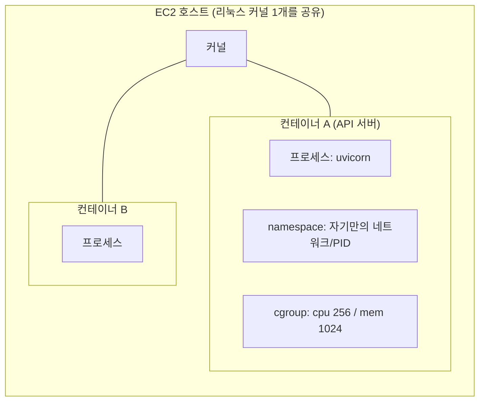

> 💡 그래서 컨테이너는 부팅이 빠르다. VM은 커널까지 통째로 올리지만, 컨테이너는 **호스트 커널을 공유**하고 namespace/cgroup으로 칸막이만 친다. 커널을 새로 안 띄우니 당연히 빠를 수밖에.

---

# ECS 아키텍처 — Control Plane vs Data Plane

ECS의 모든 것은 **두 Plane의 분리**로 설명된다. ECS만의 얘기는 아니고, 분산 시스템에서 흔히 보이는 구조다.

| Plane | 누가 소유 | 역할 |
|---|---|---|
| **Control Plane** | **AWS가 관리** (우리 눈엔 안 보임) | "결정" — 어디에 띄울지 스케줄링, 클러스터 상태 저장, API 수신 |
| **Data Plane** | **우리 소유** (EC2 인스턴스) | "실행" — 실제 컨테이너를 돌림 |

Data Plane의 각 EC2에는 **ECS Agent**라는 작은 프로그램이 돈다. 이 agent가 control plane과 data plane을 잇는 다리다.

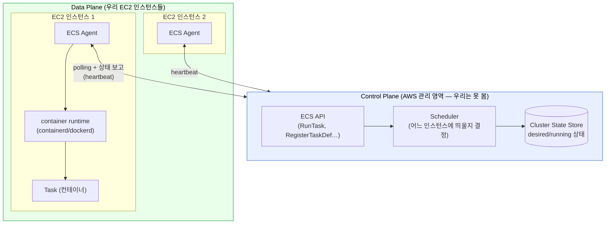

여기서 헷갈리기 쉬운 포인트 하나. **명령은 누가 누구에게 보내는 걸까?**

control plane이 agent에게 "이거 해라"라고 push하는 게 아니다. 반대로 **agent가 control plane에 주기적으로 찾아가서 "할 일 있나요? 제 상태는 이래요"라고 polling**한다. 이 heartbeat가 끊기면 control plane은 "저 인스턴스 죽었나?"를 판단한다. (뒤의 모니터링 파트에서 다시 나온다.)

---

# 객체 모델 — 6개 개념의 관계

ECS를 처음 보면 용어가 너무 많아서 멀미가 난다. 핵심 6개와 그 관계만 잡아두자.

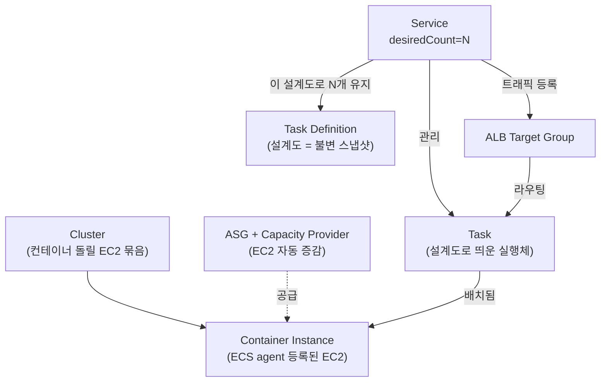

| 개념 | 한 줄 요약 |
|---|---|
| **Cluster** | 컨테이너를 돌릴 EC2 묶음(논리 그룹) |
| **Container Instance** | ECS agent가 등록된 EC2 1대 |
| **Capacity Provider / ASG** | EC2 대수를 자동으로 늘리고 줄임 |
| **Task Definition** | 컨테이너 실행 설계도(이미지·자원·env·헬스). **revision으로 불변 박제됨** |
| **Task** | 설계도로 실제 띄운 컨테이너(들) |
| **Service** | Task를 N개 유지·교체·헬스 관리하고 ALB에 연결 |

여기서 가장 중요한 건 **Task Definition은 한 번 등록하면 안 바뀐다(immutable)**는 점이다. 설정을 바꾸면 새 revision이 생긴다. 그래서 "어떤 버전으로 떠 있었는지"가 항상 명확하다. 이 불변성이 롤백을 쉽게 만든다.

---

# 🚀 부팅 플로우 — 컨테이너가 뜨기까지 9단계

> **질문 1의 답**: "ECS는 무엇을, 어디서, 어떤 순서로 읽는가?"

Service가 "Task를 하나 더 띄워야 해"라고 판단한 순간부터 컨테이너가 트래픽을 받기까지를 9단계로 따라가 보자.

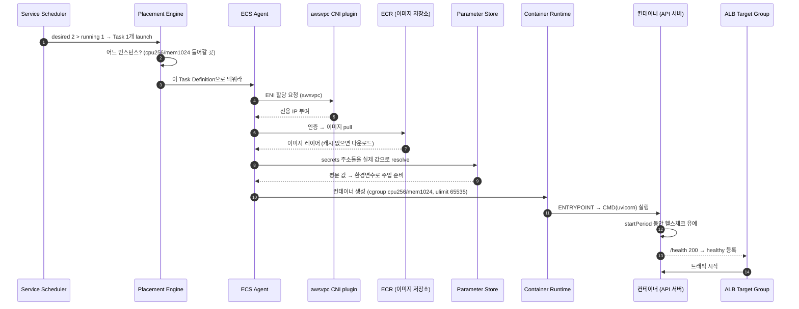

각 단계에서 ECS가 **Task Definition의 어느 부분을 읽는지** 표로 정리하면 이렇다.

| # | 단계 | ECS가 읽는 것 |
|---|---|---|
| 1 | **설계도 선택** | 어떤 Task Definition revision인지 (`family`) |
| 2 | **배치 결정(placement)** | 이 자원(`cpu`/`memory`)이 들어갈 인스턴스 찾기 |
| 3 | **ENI 할당** | `networkMode: awsvpc`면 Task에 전용 네트워크 인터페이스 |
| 4 | **이미지 가져오기** | ECR에서 이미지 pull (`image`) |
| 5 | **시크릿 주입** | Parameter Store에서 secret 값을 읽어 **환경변수로** (`secrets[]`) |
| 6 | **컨테이너 생성** | cgroup/ulimit 한도 설정 후 rootfs 마운트 |
| 7 | **프로세스 시작** | ENTRYPOINT → CMD 실행 |
| 8 | **헬스 유예** | `startPeriod` 동안 실패해도 안 죽임 |
| 9 | **트래픽 연결** | 헬스 통과하면 ALB가 트래픽 전달 (`portMappings`) |

몇 군데는 좀 더 들여다볼 가치가 있다.

**② Placement (배치 결정)** — scheduler가 "이 Task의 `cpu:256, memory:1024`가 들어갈 빈 공간이 있는 인스턴스"를 고른다. 이게 **bin-packing 문제**다. 호스트에 자원을 촘촘히 채울지, 여러 호스트에 흩뿌릴지(spread)는 placement 전략으로 조절한다.

**③ ENI 할당** — `awsvpc`라 Task마다 **자기 IP**를 가진 ENI(Elastic Network Interface)를 받는다. 그래서 Task는 호스트와 다른 IP를 갖게 되는데, 이게 나중에 "왜 localhost로 호스트에 못 닿지?" 같은 이슈의 원인이 된다. (네트워킹 파트에서 자세히)

**⑤ 시크릿 주입 (가장 헷갈리는 부분)** — Task Definition의 `secrets[]`는 **값이 아니라 주소(Parameter Store ARN)**만 들고 있다. agent가 부팅 시 그 주소로 가서 실제 값을 읽어 환경변수로 컨테이너에 넣는다. 그래서:

- 이미지 안에는 시크릿이 없다(보안상 당연). 이미지를 누가 까봐도 비밀번호가 안 나온다.
- 그런데 Parameter Store에 값이 없거나 권한이 없으면? → **`ResourceInitializationError: unable to pull secrets`**로 Task가 RUNNING까지 못 간다. 처음 ECS 만지면 한 번씩 만나는 에러다.

**⑦ ENTRYPOINT → CMD** — 리눅스 프로세스 모델 그대로다. 컨테이너의 PID 1로 ENTRYPOINT 스크립트가 뜨고, 마지막에 `exec`로 CMD(여기선 uvicorn)를 띄워 **PID 1을 넘겨준다**. 이 `exec`가 은근 중요하다. 시그널(SIGTERM 등)이 uvicorn에 직접 닿아야 graceful shutdown이 되기 때문이다. 중간 스크립트가 PID 1을 붙잡고 있으면 종료 시그널을 앱이 못 받아서 강제 종료(SIGKILL) 당하기 쉽다.

---

# 👁️ 모니터링 원리 — 헬스 신호는 하나가 아니다

> **질문 2의 답**: "ECS는 살아있는지를 어떻게 계속 감시하는가?"

핵심은 **헬스 신호가 한 개가 아니라 세 개**이고, 각자 보는 게 다르다는 것이다. 그리고 각 신호가 **상태머신**을 돌린다.

## 3중 헬스체크 — 누가 무엇을 보나

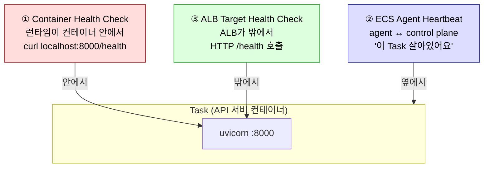

| 헬스체크 | 누가 검사 | 어디서 | 실패하면 |
|---|---|---|---|
| **① Container** | container runtime | 컨테이너 **안** | ECS가 Task를 unhealthy로 보고 **교체** |
| **② Agent Heartbeat** | ECS agent ↔ control plane | 인스턴스 **옆** | heartbeat 끊기면 인스턴스/Task를 죽은 걸로 판단 |
| **③ ALB Target** | ALB | 네트워크 **밖** | unhealthy target을 **트래픽에서 제외**(deregister) |

**왜 3개씩이나 보냐고?** 각자 사각지대가 다르기 때문이다.

- ①은 "프로세스 자체가 응답하나" — 앱 내부 데드락을 잡는다.
- ②는 "이 EC2/Task가 통신은 되나" — 인스턴스 통째 장애를 잡는다.
- ③은 "**사용자 경로**로 닿나" — 보안그룹·네트워크·LB 경로 문제를 잡는다.

하나만 보면 놓치는 장애가 꼭 있다. 그래서 안/옆/밖 층위별로 감시한다.

## startPeriod의 의미 — crash 루프를 막는 장치

컨테이너 헬스체크는 `STARTING → HEALTHY / UNHEALTHY` 상태머신을 돈다.

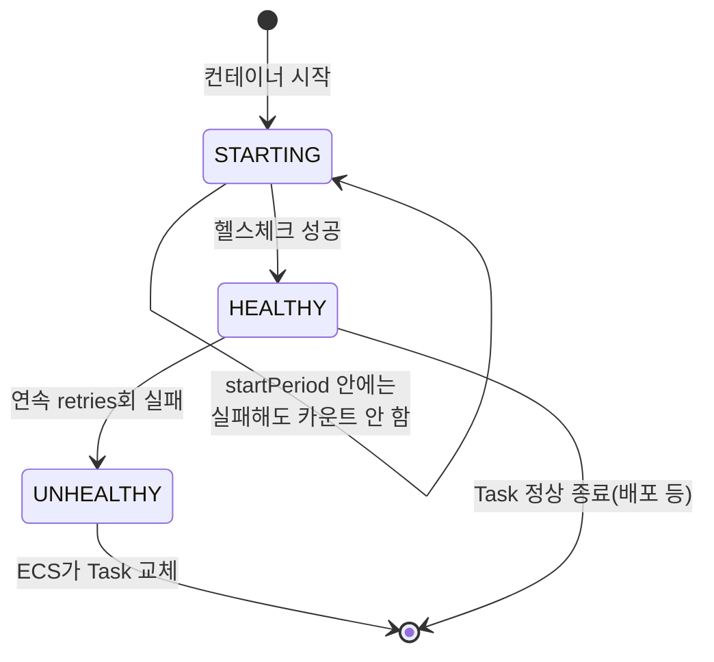

> 💡 **`startPeriod`가 왜 중요할까** — 앱이 부팅하는 동안(DB 커넥션 풀 생성, 모델 로드, 마이그레이션 대기 등) 헬스체크가 잠깐 실패하는 건 정상이다. 이 유예 기간이 없으면 "느린 부팅 → 헬스 실패 → 재시작 → 또 느린 부팅"의 **crash 루프**에 빠진다. 그래서 부팅이 느린 서비스일수록 startPeriod를 넉넉하게 줘야 한다.

## Task 생명주기 — 로그에서 보게 될 단어들

Task 하나는 태어나서 죽을 때까지 이 상태들을 지난다. 콘솔이나 로그에서 이 단어들을 만나게 된다.

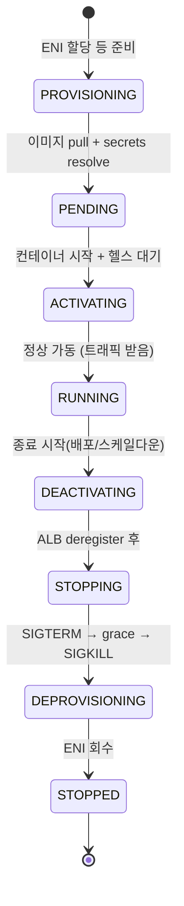

- **PROVISIONING/PENDING에서 막힌다면** → 부팅 9단계의 ④⑤(이미지/시크릿) 문제일 확률이 높다. `unable to pull secrets`가 대표 증상.
- **STOPPING의 grace** → graceful shutdown 타임아웃 동안 in-flight 요청을 정리하고 종료한다. 이 시간을 넘기면 SIGKILL로 강제 종료된다.

## 죽어도 알아서 살아나는 한 컷

위 신호들이 모이면 "죽어도 알아서 되살아나는" 동작이 완성된다.

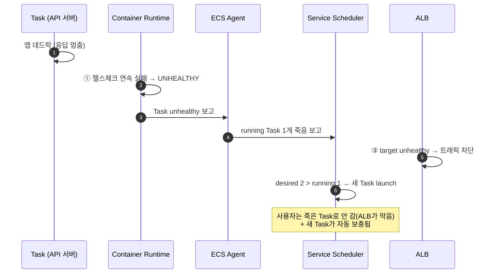

---

# Reconciliation Loop — ECS의 심장

ECS Service의 동작을 한 문장으로 줄이면 이거다.

> **"목표 상태와 현재 상태를 끊임없이 비교해 그 차이를 메우는 무한 루프."**

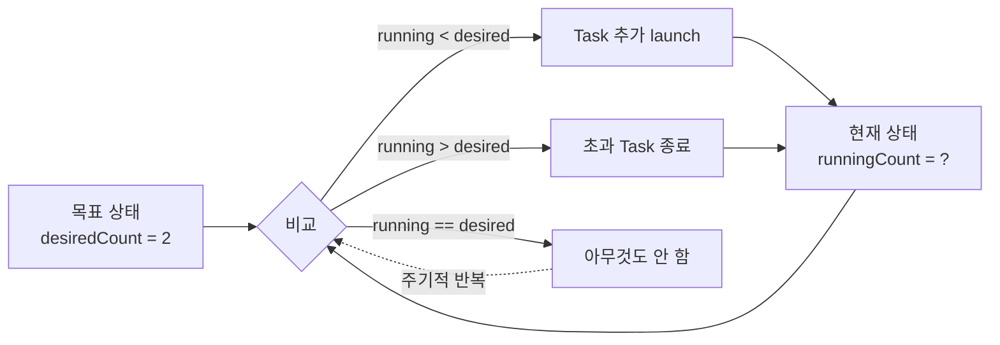

이 한 루프가 **거의 모든 것**을 설명한다.

- **Task가 죽음** → running 1 < desired 2 → 새로 띄움 (죽어도 알아서 보충)
- **스케일 아웃** → desiredCount를 3으로 바꿈 → running 2 < 3 → 1개 추가
- **rolling 배포** → 새 revision으로 desired를 채우며 옛것을 줄임
- **인스턴스 장애** → 그 위 Task들이 running에서 빠짐 → 다른 인스턴스에 재배치

참고로 이건 ECS만의 발상이 아니다. Kubernetes의 controller도 똑같은 원리로 돈다. 흔히 **선언적(declarative)** 방식이라고 부르는데, 쉽게 말하면 "어떻게(how) 해라"가 아니라 **"무엇(what)이 돼 있어야 한다"**만 정해주고 나머지는 시스템이 알아서 맞추는 식이다. 요즘 클라우드 오케스트레이션 도구들이 대부분 이렇게 동작한다.

배포도 이 루프를 응용한 것이다. **Rolling 배포**는 reconciliation을 "조금씩" 시키는 것이다.

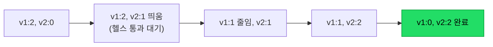

한 번에 몇 개를 바꿀지는 `minimumHealthyPercent` / `maximumPercent`로 조절한다. (예: 100%/200%면 새것을 다 띄운 뒤 옛것을 내린다.)

---

# 네트워킹 심화 — awsvpc부터 ENI 백본까지

여기서부터가 이 글에서 가장 깊이 들어가는 부분이다. 많은 ECS 글이 "awsvpc 쓰면 Task마다 IP 받아요" 정도에서 멈추는데, 그 IP가 **물리적으로 어떻게 컨테이너 안으로 들어오는지**, 그리고 호스트당 Task 수의 한계를 어떻게 늘리는지까지 보자.

## awsvpc & ENI 기본

먼저 기본부터. 우리 Task Definition은 `networkMode: awsvpc`를 쓴다고 하자.

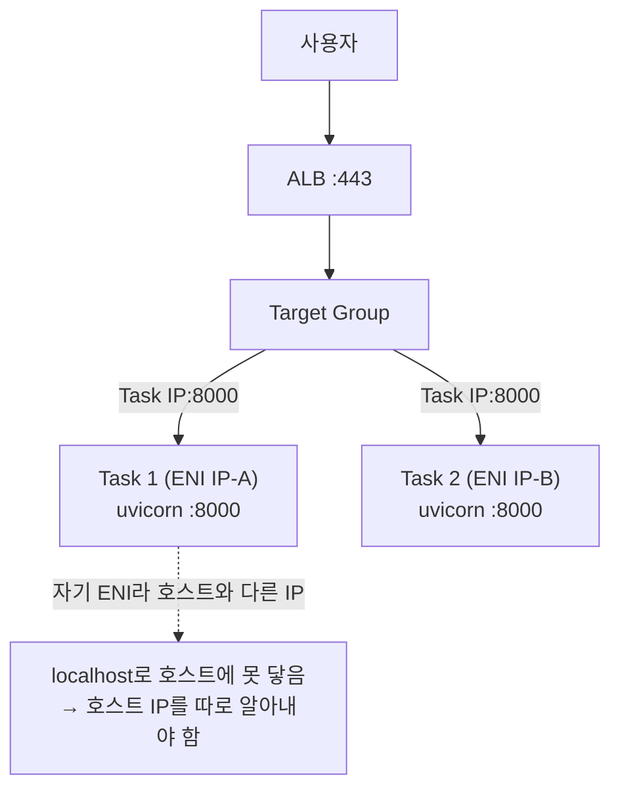

| 모드 | IP | 특징 |
|---|---|---|
| `bridge` (옛 docker 기본) | 호스트 IP + 포트 매핑 | 단순하지만 포트 충돌·격리 약함 |
| **`awsvpc`** | **Task마다 ENI(전용 IP)** | 보안그룹을 Task 단위로, IP 충돌 없음 |

awsvpc의 핵심은 **Task가 VPC 안에서 EC2 인스턴스랑 똑같은 자격의 네트워크 구성원**이 된다는 점이다. Task마다 ENI(가상 랜카드)가 붙고 VPC 사설 IP를 하나 받는다. 그래서 보안그룹을 Task 단위로 걸 수 있고, ALB는 Task의 **ENI IP:컨테이너포트**로 직접 트래픽을 보낸다.

대신 부작용도 있다. Task가 호스트와 **다른 IP**를 갖기 때문에, 컨테이너 안에서 `localhost`로 호스트의 다른 프로세스(예: 호스트에 떠 있는 모니터링 에이전트)에 닿을 수 없다. 이럴 땐 인스턴스 메타데이터 서비스(IMDSv2) 등으로 **호스트의 실제 IP를 조회해서** 그 주소로 보내야 한다. awsvpc를 쓰면 한 번쯤 마주치는 함정이다.

## ENI가 컨테이너 안으로 들어가는 과정 — CNI 플러그인 체인

그럼 그 ENI는 **어떻게** 컨테이너의 네트워크 namespace 안으로 들어갈까? 여기서 **CNI(Container Network Interface) 플러그인**이 등장한다.

ECS Agent는 Task를 띄울 때 **CNI 플러그인들을 체인으로 호출**해서 컨테이너의 네트워크 namespace를 구성한다. 핵심은 **호스트에 붙은 ENI를 컨테이너의 namespace 안으로 "옮긴다"**는 점이다.

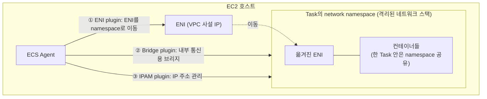

플러그인 체인은 대략 이런 역할을 나눠 맡는다.

- **ENI plugin** — 호스트에 attach된 ENI를 컨테이너의 network namespace로 이동시키고, 라우팅을 설정한다. 이게 awsvpc의 핵심.
- **Bridge plugin** — 같은 Task 내부 통신이나 보조 인터페이스용 브리지를 만든다.
- **IPAM plugin** — IP 주소 할당/회수를 관리한다.

> 💡 여기서 **namespace**가 다시 등장한다. 맨 앞에서 "컨테이너는 namespace로 격리된 프로세스"라고 했는데, **네트워크 namespace**는 그중 네트워크 스택(인터페이스·라우팅 테이블·iptables)만 따로 격리한 복사본이다. 한 Task 안의 여러 컨테이너는 **같은 네트워크 namespace를 공유**한다. 그래서 같은 Task의 컨테이너끼리는 `localhost`로 서로 통신할 수 있는 것이다.

## trunk/branch ENI — 호스트당 Task 수의 벽을 넘기

awsvpc에는 현실적인 골칫거리가 하나 있다. **EC2 인스턴스 타입마다 붙일 수 있는 ENI 수가 정해져 있다**는 점이다. Task마다 ENI를 하나씩 먹으니, 작은 인스턴스에서는 ENI 한도 때문에 **CPU·메모리는 남는데도 Task를 더 못 띄우는** 상황이 생긴다.

이를 해결하는 게 **ENI trunking**이다.

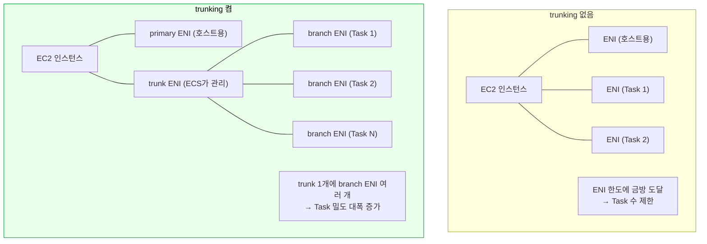

trunking을 켜면(`awsvpcTrunking` 계정 설정) ECS가 인스턴스에 **trunk ENI**를 하나 붙이고, Task들은 그 trunk에 매달린 **branch ENI**를 받는다. 호스트가 직접 소비하는 ENI는 primary 1개 + trunk 1개로 고정되고, 실제 Task용 IP는 trunk 아래 branch로 확장된다.

| 구분 | 일반 ENI (x-ENI) | branch ENI |
|---|---|---|
| 부착 방식 | 인스턴스에 직접 attach | trunk ENI에 매달림 |
| 밀도 | 인스턴스 ENI 한도에 묶임 | trunk 하나로 여러 개 수용 |
| 효과 | Task 수 제한 | **호스트당 Task 수 크게 증가** |

예를 들어 trunking이 없으면 작은 인스턴스에서 Task 2개가 한계였던 게, 켜면 같은 인스턴스에서 그보다 훨씬 많은 Task를 띄울 수 있다. (Fargate가 내부적으로 높은 Task 밀도를 내는 것도 이런 trunk/branch ENI 구조와 무관하지 않다.)

## VPC 백본 & PrivateLink — 트래픽은 인터넷을 안 거친다

ECS가 동작하려면 control plane(ECS API), ECR, Parameter Store 같은 AWS 서비스와 끊임없이 통신해야 한다. 그런데 이 트래픽이 **공용 인터넷을 타고 나갔다 들어온다면** 어떨까? 지연도 늘고, 보안상으로도 인터넷에 노출된다.

그래서 **VPC Endpoint(PrivateLink)**를 쓴다. PrivateLink를 걸어두면 ECS·ECR·Parameter Store 같은 서비스로의 호출이 **AWS 내부 네트워크 백본 안에 머물고 인터넷을 거치지 않는다.**

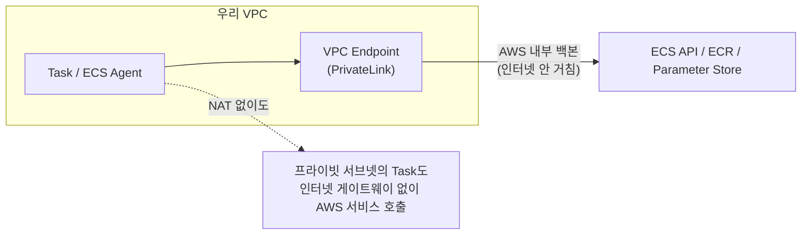

실무적으로 이게 주는 이점은 두 가지다.

- **보안** — 프라이빗 서브넷의 Task가 인터넷 게이트웨이/NAT 없이도 ECR에서 이미지를 당기고 시크릿을 읽을 수 있다. 외부로 나가는 경로 자체를 안 열어도 된다.
- **성능·비용** — 인터넷 왕복이 사라지니 지연이 줄고, NAT 게이트웨이 데이터 처리 비용도 아낀다.

## 서비스 간 통신 — Service Discovery vs Service Connect

마지막으로, Task끼리(서비스 간) 어떻게 서로를 찾아 통신할까? Task는 죽고 살아나며 IP가 계속 바뀌는데, 하드코딩할 수는 없다. AWS는 두 가지 방법을 제공한다.

| | **Service Discovery** (Cloud Map) | **Service Connect** |
|---|---|---|
| 방식 | DNS 기반 — 서비스에 DNS 이름을 부여, 현재 살아있는 Task IP로 resolve | 각 Task에 **Envoy 사이드카 프록시**를 붙여 서비스 메시처럼 동작 |
| 발견 | DNS 조회 (TTL 캐시 영향 있음) | 프록시가 Cloud Map에 **실시간 API 조회** |
| 장애 전환 | TTL 만료를 기다려야 해서 느릴 수 있음 | 프록시가 건강한 인스턴스로 **빠르게 재라우팅** |
| 부가 기능 | 거의 없음 (이름 해석만) | 로드밸런싱·재시도·모니터링(메트릭) 내장 |
| 비용 | 추가 컨테이너 없음 | Task마다 프록시 컨테이너 CPU/메모리 추가 과금 |

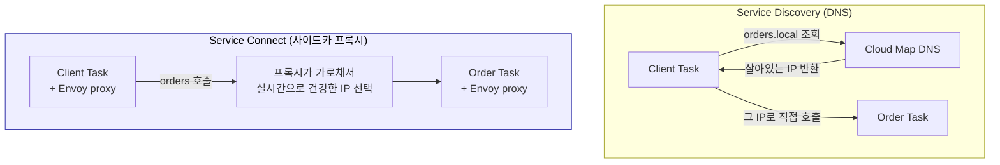

한마디로 **Service Discovery는 DNS로 이름만 풀어주는 가벼운 방식**이고, **Service Connect는 프록시를 끼워 더 빠른 장애 전환과 관측성을 주는 무거운 방식**이다. DNS 캐시 때문에 죽은 Task로 한참 트래픽이 가는 게 싫다면 Service Connect가, 단순하고 가벼운 게 좋으면 Service Discovery가 어울린다. 단, Service Connect는 일부 배포 컨트롤러(예: Blue/Green)와 호환되지 않는 제약이 있으니 도입 전 확인이 필요하다.

---

# 리소스 격리 & IAM 3역할

## 자원 격리 — cgroup으로 떨어지는 값들

부팅 6단계에서 본 cgroup 한도가 실제로 어떤 효과를 내는지 보자.

| Task Definition 필드 | 커널 메커니즘 | 효과 |
|---|---|---|
| `cpu: 256` | cgroup cpu quota | 1024 = 1 vCPU 기준 → 256 = 0.25 vCPU 상한 |
| `memory: 1024` | cgroup memory limit | 1024MB 초과 시 **OOM kill** (컨테이너 죽음) |
| `ulimits.nofile: 65535` | rlimit RLIMIT_NOFILE | 열 수 있는 fd(소켓/파일) 상한 |

> 💡 메모리 초과는 **무조건 죽는다(OOM kill)**. 그래서 메모리 한도는 실측 + 여유로 잡아야 한다. 반면 CPU는 초과해도 죽지 않고 throttle(느려짐)될 뿐이다. 이 차이를 모르면 "왜 컨테이너가 갑자기 죽지?"의 원인을 한참 헤맨다.

## IAM 3역할 — 가장 많이 혼동하는 부분

ECS에는 **목적이 다른 세 개의 역할**이 있다. 이걸 구분 못 하면 권한 에러가 날 때 어디를 봐야 할지 모른다.

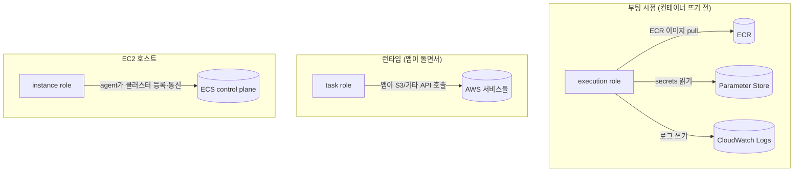

| 역할 | 누가 쓰나 | 언제 | 예시 권한 |
|---|---|---|---|
| **execution role** | ECS agent (내 코드 아님) | **부팅 시** | ECR pull, secret 읽기, 로그 그룹 쓰기 |
| **task role** | **내 앱 코드** | **런타임** | 앱이 S3 업로드, 다른 AWS API 호출 |
| **instance role** | EC2의 ECS agent | 상시 | 클러스터 등록, heartbeat |

한 문장으로 구분하면 이렇다.

> **execution role = "컨테이너를 띄우기 위해 ECS가 쓰는 권한"**, **task role = "띄워진 앱이 일하려고 쓰는 권한"**.

증상으로도 구분된다. **시크릿을 못 읽어서 부팅이 실패**하면 execution role 문제고, **앱이 떠 있는데 S3 호출에서 권한 에러**가 나면 task role 문제다. 어느 역할을 봐야 할지가 증상에서 바로 나온다.

---

# 전체 그림 한 장

지금까지를 한 장으로 묶으면 이렇다.

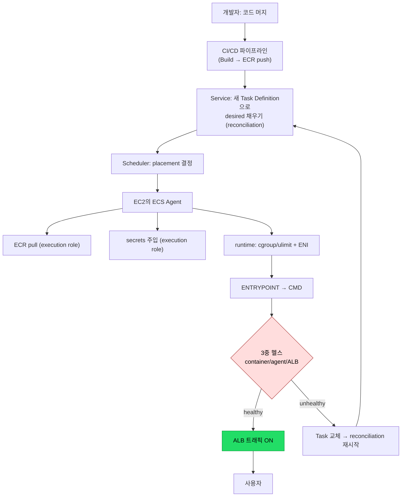

## 이것만 기억해도 된다 — 핵심 5개

1. **목표만 정해주면 된다** — 나는 "이렇게 돼 있어야 해"만 말하고, reconciliation loop가 현재와 비교해 차이를 메운다.
2. **control plane(결정) ↔ data plane(실행) 분리**, 그 사이를 agent가 pull(polling)로 잇는다.
3. **부팅 = 설계도 읽고 → 배치 → ENI → 이미지 pull → secrets → cgroup으로 컨테이너 생성 → ENTRYPOINT**.
4. **모니터링 = 3중 헬스(안/옆/밖) + 상태머신**. startPeriod가 crash 루프를 막는다.
5. **네트워크는 awsvpc로 Task마다 ENI**, CNI 플러그인이 그 ENI를 namespace로 옮기고, trunk/branch ENI로 밀도를 늘린다.

---

# 용어 사전

| 용어 | 한 줄 |
|---|---|
| **Control Plane** | 결정·스케줄링·상태저장 (AWS 관리, 안 보임) |
| **Data Plane** | 실제 컨테이너가 도는 곳 (우리 EC2) |
| **ECS Agent** | EC2에 상주, control plane과 polling으로 통신 |
| **Placement / bin-packing** | Task를 어느 인스턴스에 넣을지 결정 |
| **awsvpc / ENI** | Task마다 전용 IP를 주는 네트워크 모드와 그 인터페이스 |
| **CNI 플러그인** | ENI를 컨테이너 namespace로 옮겨 네트워크를 구성 |
| **trunk / branch ENI** | 호스트당 Task(ENI) 밀도를 늘리는 trunking 구조 |
| **PrivateLink / VPC Endpoint** | AWS 서비스 호출을 내부 백본에 가두어 인터넷 우회 |
| **Service Discovery / Service Connect** | DNS 기반 / 사이드카 프록시 기반 서비스 간 통신 |
| **execution role / task role / instance role** | 부팅용 / 앱용 / agent용 — 목적이 다른 IAM 3역할 |
| **startPeriod** | 부팅 유예 — 이 동안 헬스 실패를 무시해 crash 루프 방지 |
| **Reconciliation loop** | desired vs running을 비교해 차이를 메우는 무한 루프 |
| **cgroup / namespace** | 자원 제한 / 격리 — 컨테이너의 커널 기반 |
| **OOM kill** | 메모리 한도 초과 시 커널이 컨테이너를 강제 종료 |

<!-- 이미지 제안: awsvpc trunk/branch ENI 구조 공식 다이어그램 | 후보: AWS 공식 문서 "Increasing Amazon ECS Linux container instance network interfaces" 페이지의 도식 | 저작권 확인 필요(AWS 문서 이미지 직접 게시 대신 링크 권장) -->

---

여기까지가 Task Definition 한 장을 교본 삼아 따라가 본 ECS의 내부 동작이다. 처음엔 용어만 수십 개라 막막하지만, 결국 **"목표를 선언하면 루프가 알아서 맞춘다"**는 한 문장과, **부팅 순서 / 3중 헬스 / awsvpc ENI**라는 세 축으로 거의 다 꿰어진다. 다음에 ECS 콘솔에서 `PROVISIONING`이나 `unable to pull secrets` 같은 단어를 만나면, 이 글의 어느 단계에서 막힌 건지 바로 감이 올 것이다.

---

## 📚 참고자료

- [Under the Hood: Task Networking for Amazon ECS (AWS Compute Blog)](https://aws.amazon.com/blogs/compute/under-the-hood-task-networking-for-amazon-ecs/)
- [Allocate a network interface for an Amazon ECS task — awsvpc (AWS Docs)](https://docs.aws.amazon.com/AmazonECS/latest/developerguide/task-networking-awsvpc.html)
- [Increasing Amazon ECS Linux container instance network interfaces — ENI trunking (AWS Docs)](https://docs.aws.amazon.com/AmazonECS/latest/developerguide/container-instance-eni.html)
- [amazon-ecs-cni-plugins (GitHub) — ENI / Bridge / IPAM 플러그인](https://github.com/aws/amazon-ecs-cni-plugins)
- [Use Service Connect to connect Amazon ECS services (AWS Docs)](https://docs.aws.amazon.com/AmazonECS/latest/developerguide/service-connect.html)

