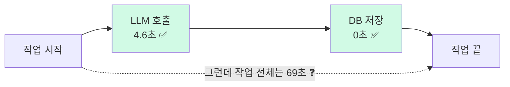
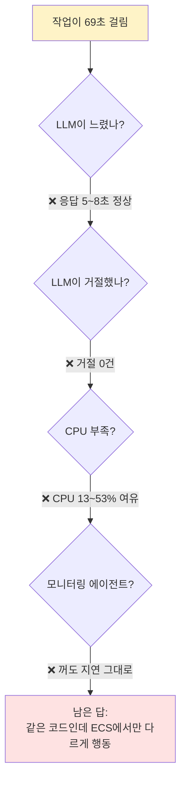
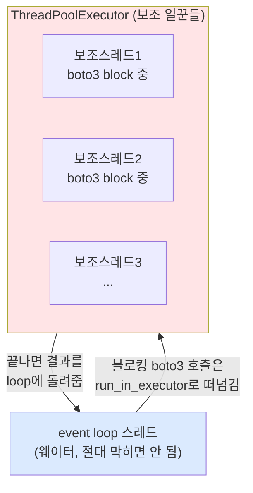
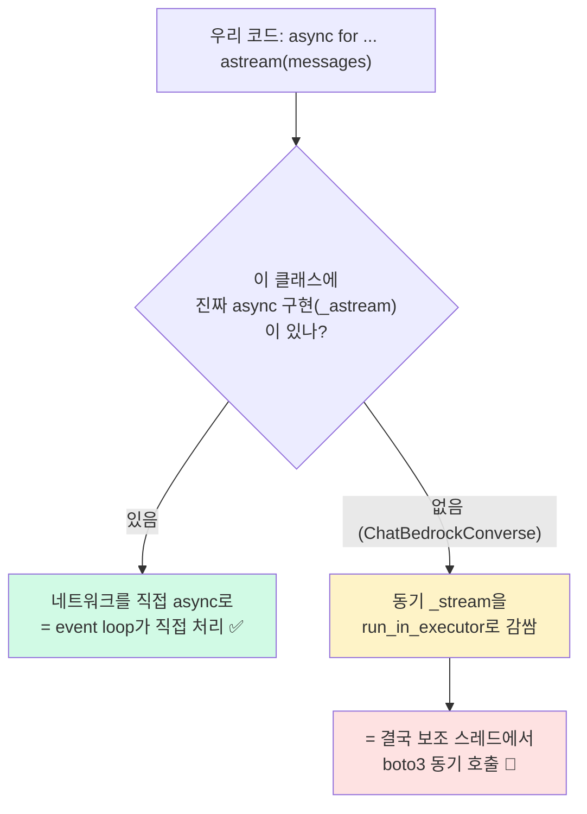
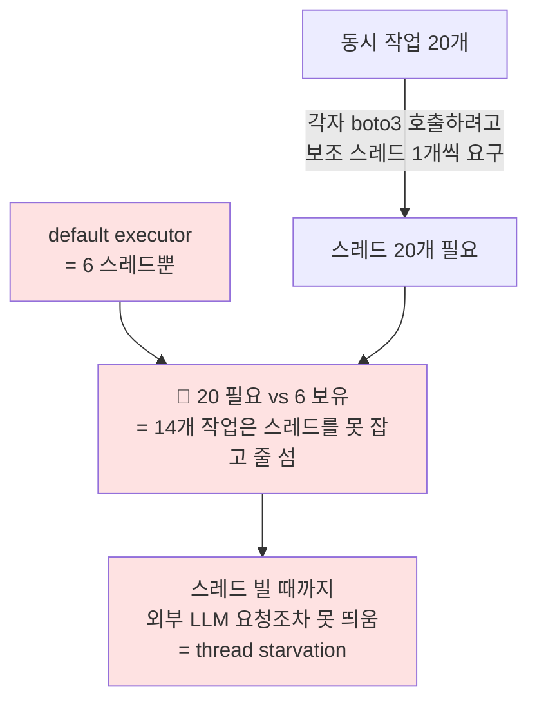
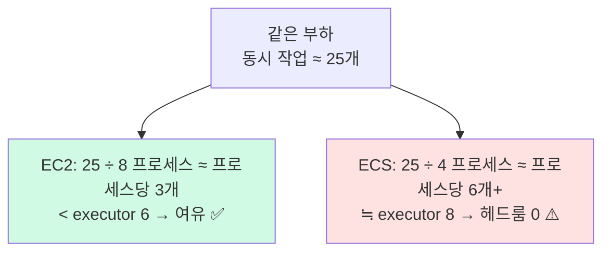
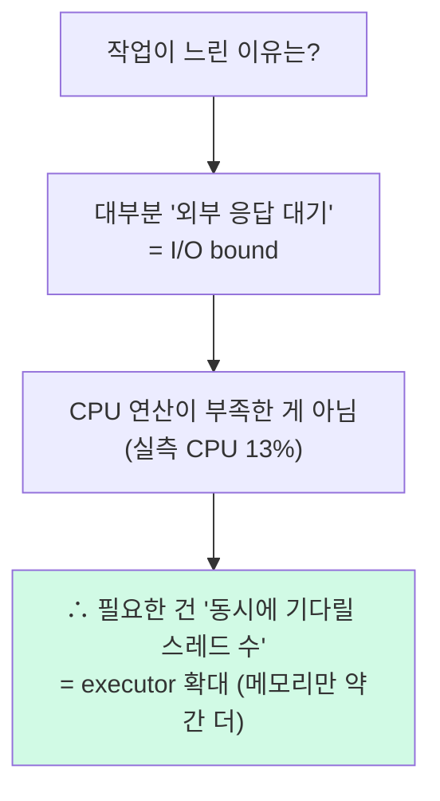

# EC2에서 ECS로 옮겼더니 응답이 69초가 됐다

[지난 글](https://velog.io/@5hseok/esc-migration-from-ec2)에서 "지난 마이그레이션이 왜 실패했는지, 어떻게 성공시켰는지는 다음 포스트에서 따로 정리하겠다"고 적어뒀다. 이 글이 그 이야기다.

상황은 이랬다. **LangChain으로 LLM 응답을 만들어주는** 백그라운드 워커를 EC2에서 ECS로 옮겼더니, 평소 **3.5초**면 끝나던 작업 하나가 트래픽이 몰릴 때 **최대 69초**까지 늘어졌다. 결국 EC2로 롤백하고서야 멈췄다. 마이그레이션을 다시 맡으면서 "그래서 그때 도대체 뭐가 문제였나"를 처음부터 파보기로 했다.

그런데 원인이 좀 의외였다. **LLM도, 모니터링 에이전트도, CPU도 아니었다.** 우리가 분명히 `await`를 붙여서 비동기로 호출한다고 믿었던 그 코드가, 사실은 바닥에서 동기로 돌고 있었다. 이 글은 그 원인을 추적한 트러블슈팅 기록이자, **"`async`/`await`를 썼다고 비동기인 게 아니다"**라는 개념을 풀어보는 글이다.

> 중급 백엔드 개발자를 대상으로 썼다. asyncio·스레드를 들어는 봤지만 "그래서 그게 실무에서 어떻게 터지는데?"가 궁금한 분이라면 잘 맞을 거다.

---

# 무슨 일이 있었나

먼저 측정된 수치들을 보자.

| | 평상시 | 문제 발생 시 |
|---|---|---|
| 작업 1건 처리 시간 | 3.5초 | **69초** (최대 300초) |
| 큐 적체 | 거의 없음 | **113건** 쌓임 |
| 대응 | - | 워커 수를 8 → 20개로 늘림 → **오히려 악화** |

워커를 늘렸는데 더 나빠졌다는 게 첫 번째 힌트였다. 보통 일꾼을 늘리면 빨라져야 정상인데, 더 느려졌다. 자원이 부족한 게 아니라 **뭔가 구조적인 병목**이 있다는 신호다.

그리고 진짜 미스터리는 따로 있었다. 작업을 단계별로 쪼개서 시간을 재봤더니 이렇게 나왔다.



LLM 호출도 4.6초로 멀쩡하고, DB도 0초다. 그런데 작업 전체는 69초. **나머지 64초는 도대체 어디서 샌 걸까?** 분명히 작업 안의 어떤 단계도 64초를 먹지 않았는데, 합쳐놓으면 69초가 된다. 누가 중간에서 시간을 다 잡아먹고 있었다.

---

# 의심한 원인을 하나씩 지워나가기

"느리다"고 하면 보통 의심하는 것들이 있다. 그걸 추측으로 넘기지 않고 **전부 실측으로 확인해서 지웠다.** 이 지우는 과정 자체가 결론의 신뢰도를 좌우하기 때문이다.

| 의심한 원인 | 배제한 근거 (실측) |
|---|---|
| LLM(Bedrock)이 느림 | 응답 p99 **5~8초**, 첫 토큰 2~4초 — 정상 |
| LLM이 요청을 거절(429) | 거절 **0건**, 에러 0건 |
| 재시도가 누적됨 | **첫 시도 성공 100%** — 재시도 안 함 |
| LLM 호출 자체가 느림 | 콜 자체 **4.6초** — 즉 나머지 64초는 LLM **바깥** |
| CPU 부족 | 서버 CPU **13~53%** — 한참 여유 |
| DB 느림 | DB 응답 **0ms** |
| 메모리 누수 | EC2로 되돌린 뒤 오래 켜둬도 멀쩡 — 누수면 EC2도 터져야 함 |

여기에 하나 더, 처음엔 **모니터링 에이전트(APM)**를 강하게 의심했다. ECS로 옮기면서 모니터링 에이전트의 연결 방식도 같이 바뀌었기 때문이다(컨테이너마다 하나씩 → 호스트당 하나로). 시점도 절묘하게 맞아떨어져서 "이게 원인이다" 싶었다.

그런데 부하를 걸어 대조 실험을 해봤더니 — **모니터링 에이전트를 완전히 꺼도 응답 지연이 그대로였다.** 오히려 더 심해지기도 했다. 가장 유력하게 봤던 원인이 빗나간 거다.



지운 걸 다 빼고 나니 논리적으로 하나만 남았다. **같은 이미지(코드)인데 EC2는 영구 정상이고 ECS만 깨진다.** 자원도 다 여유다. 그렇다면 코드 탓도 자원 탓도 아니고, **"환경에 따라 다르게 행동하는 무언가"**가 코드 안에 숨어 있다는 뜻이다.

그 무언가를 이해하려면 잠깐 개념 하나를 짚고 가야 한다.

---

# 잠깐 — `await`를 붙였다고 비동기인 게 아니다

여기서부터가 이 문제의 핵심 개념이다. 우리 워커 코드는 분명히 이렇게 생겼다.

```python
async for chunk in llm.astream(messages):
    ...
```

`astream`에 `await`(정확히는 `async for`)를 붙여서 호출했으니 당연히 비동기라고 믿었다. 그런데 아니었다. 왜 그런지 이해하려면 세 가지를 순서대로 봐야 한다.

## ① GIL — 파이썬 스레드는 한 번에 한 줄만 실행한다

파이썬(CPython)에는 **GIL(Global Interpreter Lock)**이라는 자물쇠가 있다. 한 프로세스 안에서 파이썬 코드를 실제로 실행하는 스레드는 **언제나 딱 하나**다. 스레드가 10개든 100개든 마찬가지다.

그런데 중요한 예외가 있다. **GIL은 "파이썬 코드를 실행할 때"만 잡고, I/O로 기다리는 동안엔 놓는다.**

| 작업 종류 | 스레드를 늘리면? |
|---|---|
| **CPU bound** (계산, 암호화) | ❌ 한 번에 하나라 안 빨라짐 → 멀티**프로세스**가 답 |
| **I/O bound** (네트워크, DB, **LLM 호출**) | ✅ 여러 스레드가 "기다림"을 동시에 겹칠 수 있어 효과적 |

우리 워커의 일은 **LLM 응답을 기다리는 것**, 즉 극단적인 I/O bound다. 작업의 99%가 "외부 응답 대기"다. 이게 나중에 "해결책이 CPU 증설이 아니라 스레드 확대"인 이유가 된다. 일단 기억만 해두자.

## ② event loop — 웨이터 한 명이 테이블 20개를 본다

`asyncio`는 **스레드 하나** 위에서 수백 개의 코루틴을 번갈아 돌린다. 그 교통정리를 하는 게 event loop다. 식당 웨이터로 비유하면 딱 맞는다.

웨이터(event loop) 한 명이 테이블 20개(작업 20개)를 담당한다. 한 테이블 주문을 주방에 넣고 음식이 나올 때까지 멍하니 서 있지 않는다. 주문만 넣고 바로 옆 테이블로 간다. "음식 기다리는 시간"이 곧 I/O 대기다. 그래서 **한 명으로도 20개 테이블을 동시에 진행**하는 것처럼 보인다.

```python
async def handle_table(table):
    order = take_order(table)         # 내가 직접 함
    food = await kitchen.cook(order)  # ← 여기서 "양보". 다른 테이블 보러 감
    serve(table, food)                # 음식 나오면 돌아와서 이어감
```

핵심 규칙은 이거다. **모든 작업이 대기할 때 `await`로 양보하기 때문에** 동시에 진행되는 것처럼 보인다. 그런데 만약 어떤 코드가 `await` 없이 그냥 멈춰버리면? **웨이터가 그 테이블 앞에 얼어붙는다.** 나머지 19개 테이블이 전부 정지한다.

## ③ 동기 코드를 비동기 세계에 끼우는 법 — `run_in_executor`

문제는 세상의 수많은 라이브러리가 아직 **동기(blocking)**라는 거다. 대표가 AWS 공식 SDK인 **`boto3`**다. `boto3`로 외부 API를 호출하면 응답이 올 때까지 그 스레드를 통째로 붙잡고 기다린다. `await`가 없다.

이걸 event loop 스레드에서 그냥 부르면 웨이터가 얼어붙는다. 그래서 asyncio는 이런 동기 코드를 **별도의 보조 스레드로 떠넘긴다.** 그 도구가 `run_in_executor`다.



여기서 **executor**가 등장한다. executor = "블로킹 작업을 떠맡는 보조 스레드들의 풀(pool)". 그리고 기본값(default executor)을 안 주면, 보조 스레드 수는 이렇게 정해진다.

```
max_workers = min(32, (CPU 코어 수) + 4)
```

**이 한 줄이 사건의 전부였다.** 2 vCPU짜리 인스턴스라면 `min(32, 2+4)` = **6개**. 4 vCPU여도 `min(32, 4+4)` = **8개**. 보조 스레드는 고작 6~8개뿐이라는 얘기다.

---

# 🔥 진짜 원인 — LangChain `ChatBedrockConverse`와 thread starvation

이제 조각을 맞춰보자. 우리가 쓰던 LLM 클라이언트는 `langchain`의 `ChatBedrockConverse`였다. 그런데 이 클래스는 내부적으로 **동기 SDK인 `boto3`를 쓴다.** 진짜 async 구현(`_astream`)이 없다.

`langchain` 베이스 클래스에는 "진짜 async 구현이 없으면, 동기 구현을 `run_in_executor`로 감싸서 비동기인 척한다"는 자동 fallback이 있다. 그래서 우리가 분명히 `async for ... astream(...)`이라고 썼지만, **문법만 async였지 바닥에선 보조 스레드 하나를 잡아먹는 동기 호출**이었던 거다.



이제 충돌이 보인다. 워커는 한 프로세스에서 동시에 **20개 작업**을 진행한다(동시 실행 상한 `MAX_JOBS=20`). 그 20개가 전부 LLM을 부르려고 한다. 각자 보조 스레드 하나씩을 요구하는데, **보조 스레드는 6개뿐이다.**



이게 **thread starvation(스레드 고갈)**이다. 작업은 LLM을 부르고 싶은데, **부를 보조 스레드 자리가 없어서** 외부에 요청을 보내지도 못한 채 워커 안에서 줄을 서 있었다. 그래서 메트릭상 이런 모순이 생긴 거다.

- **LLM은 빨랐다** — 요청이 도착한 것만 보면 2~3초. 맞다. 다만 요청이 늦게 도착했을 뿐.
- **CPU는 놀고 있었다(13%)** — 연산이 아니라 "스레드 자리 기다리기"였으니까.
- **그런데 작업 전체는 69초** — 시간은 전부 스레드 자리를 기다리는 데서 샜다.

처음의 "나머지 64초는 어디서 샜나?"의 답이 여기 있었다. LLM 안도, DB 안도 아닌, **"스레드 자리를 기다리는 큐"**에서 샌 거다.

---

# 그런데 왜 EC2는 멀쩡했을까

여기서 한 가지가 안 풀린다. 같은 코드, 같은 라이브러리인데 EC2에서는 몇 달을 멀쩡히 돌았다. 결함이 코드에 있었다면 EC2도 터졌어야 한다. 뭐가 달랐을까?

답은 **인스턴스 한 대의 스펙이 아니라, "총 프로세스 수"**였다.

워커는 호스트(인스턴스) 하나마다 프로세스 2개를 띄우고 각 프로세스가 위 공식대로 executor를 만든다. 그런데 EC2와 ECS는 "같은 양의 일을 몇 대로 나눠 처리하느냐"가 달랐다.

| | EC2 (정상 🟢) | ECS (문제 🔴) |
|---|---|---|
| 인스턴스 | 작은 거 (2 vCPU) | 큰 거 (4 vCPU) |
| 대수 | **4대** | **2대** |
| 프로세스/대 | 2 | 2 |
| **총 프로세스** | **8** | **4** |
| executor/프로세스 | 6 | 8 |
| **fleet 전체 스레드** | 8 × 6 = **48** | 4 × 8 = **32** |

반전 포인트가 보이는가. ECS는 인스턴스 하나만 보면 CPU도 더 많고(4 vCPU) executor도 더 크다(8 > 6). **그런데도 thread starvation이 발생했다.** 왜냐면 "큰 인스턴스 적게"로 가면서 총 프로세스가 8 → 4로 반토막 났기 때문이다. 같은 양의 작업이 절반의 프로세스로 몰리면, **프로세스당 동시 작업이 2배**가 된다.



EC2는 8개 프로세스가 부하를 잘게 나눠 흡수해서 프로세스당 동시 작업이 3개 수준이었다. executor 6개 안에 들어오니 여유가 있었다. **잠복해 있던 결함이 넉넉한 프로세스 수 덕에 가려져 있던** 거다.

ECS는 헤드룸이 0이라 작업이 조금만 느려져도 악순환에 빠진다. 스레드를 못 잡으면 작업이 더 느려지고, 느려진 작업이 슬롯을 더 오래 잡고, 동시 작업이 `MAX_JOBS=20`까지 차오르고, 8개 스레드로 20개를 감당 못 하니 응답 시간이 계속 늘어난다. ECS로 옮긴 직후가 아니라 **트래픽이 쌓이다 임계에 닿는 순간** 지연이 폭증한 것도 이 때문이다.

> "큰 인스턴스 적게"가 "작은 인스턴스 여럿"보다 스레드 관점에서 손해일 수 있다. 인스턴스 스펙만 보고 "더 큰 거니까 괜찮겠지" 했다가, 정작 중요한 **총 프로세스 수**가 줄어든 걸 놓친 거다.

---

# 해결 — executor를 직접 키운다 (CPU 증설이 아니라)

원인이 "보조 스레드 6개 < 동시 작업 20개"이므로, 해결은 단순하다. **보조 스레드 수를 명시적으로 늘린다.** 워커 시작 시점에 default executor를 더 큰 걸로 갈아끼우면 된다.

```python
# 워커 startup
asyncio.get_running_loop().set_default_executor(
    ThreadPoolExecutor(
        max_workers=40,            # MAX_JOBS(20) × 2, 여유 2배
        thread_name_prefix="llm-exec",
    )
)
```

부하 검증 결과는 명확했다.

| | 수정 전 🔴 | 수정 후 🟢 |
|---|---|---|
| executor 크기 | min(32, cpu+4) = 6~8 | **40** |
| stall(멈춤) 건수 | 7건 | **0건** |
| 최대 작업 시간 | 50초 | **19초** |

여기서 한 가지를 짚고 넘어가야 한다. **왜 CPU 증설이 아니라 스레드 확대였나?**



스레드를 40개로 늘려도 대부분 **I/O 대기 상태**라 GIL을 놓고 있다(앞의 ① 기억하는가). 그래서 CPU를 거의 안 먹는다. 추가 비용은 스레드당 약간의 메모리뿐이고, **인스턴스 증설은 필요 없었다.**

> ⚠️ 단, "스레드를 무작정 많이 = 좋다"가 아니다. 만약 **CPU bound** 작업이었다면 스레드를 늘려도 GIL 때문에 안 빨라지고 컨텍스트 스위칭만 늘었을 거다. 이번 건 **I/O bound라서 스레드 확대가 정답**인 케이스였다. 그래서 작업 성격(I/O냐 CPU냐)을 먼저 판별하는 게 핵심이다.

---

# 그런데 이게 근본 해결이 맞나 — 좀 솔직해지자면

여기까지 보면 깔끔하게 끝난 것 같지만, 사실 executor를 키운 건 **증상을 막은 거지 병을 고친 게 아니다.** 진짜 병은 `boto3`가 동기 SDK라 LLM 호출이 보조 스레드를 빌려야만 돈다는 것 자체다. 스레드 풀을 아무리 키워도, 동기 호출을 스레드로 감싸서 돌리는 구조 자체는 그대로 남아 있다.

그럼 진짜 끝은 뭘까? `ChatBedrockConverse`가 진짜 async 구현(`_astream`)을 갖는 거다. 그러면 보조 스레드를 빌릴 필요 없이 event loop가 LLM 호출을 직접 처리하니, executor 크기 같은 건 신경 쓸 일도 없어진다.

그래서 "그럼 내가 `_astream`을 구현해서 LangChain에 PR을 올려볼까?" 싶어 코드를 까봤는데, 이미 답이 적혀 있었다. **LangChain 쪽 입장은 "`boto3`가 네이티브 async를 지원하면 우리도 async streaming을 지원하겠다"**는 거였다. 그런데 `boto3`의 네이티브 async 지원은 수년째 진척이 없다. 결국 LangChain은 `boto3`만 바라보는 상황이고, 기다리자니 끝이 안 보였다.

그래서 "그냥 내가 이슈 올리고 직접 구현해서 기여하자"로 마음이 기울었다. ...인데 여기서 좀 김 빠지는 이야기가 하나 있다.

사실 비슷한 걸 한 번 해봤다. 예전에 LLM 응답의 request-id를 로그에 남기려고(디버깅할 때 provider 콘솔이랑 바로 엮으려고) LangChain에 [관련 기능을 제안하는 이슈](https://github.com/langchain-ai/langchain/issues/36983)를 올렸다. 이미 구현까지 끝나 있던 선행 PR이 기여자 잠수로 닫힌 게 있어서, 그걸 이어받아 머지까지 끌고 가겠다고 손도 들었다. 그런데 그 이슈, **올린 지 두 달이 다 되도록 메인테이너한테서 답이 없다.** LangChain은 "assign 받기 전엔 PR 작업을 시작하지 말라"는 정책이라, 답을 기다리는 것 말곤 딱히 할 수 있는 게 없다.

...이러다 보니 솔직히 async streaming 쪽도 "또 이슈 올려놓고 두 달 기다리는 거 아냐?" 싶어서 동기부여가 영 안 생긴다. ~~그래서 지금 좀 미뤄두고 있다.~~ 곧 할 거다. 아마도.

그래도 방향은 명확하다. executor 확대는 지금 당장 워커를 살려두는 임시방편이고, 진짜 끝은 upstream에 네이티브 async가 들어가는 거다. 언젠가 그게 머지되는 날이 오면, 이 글의 `set_default_executor` 한 줄은 지워도 되는 날도 같이 온다.

---

# 결론 — 이것만 기억하면 된다

길게 돌아왔지만 결론은 한 문장이다.

> **느린 건 LLM도 모니터링도 아니라, 동기(boto3) 호출을 비동기로 못 띄운 우리 워커의 스레드 풀이 동시 작업 수보다 작아서 외부 요청조차 못 보낸 것(thread starvation)**이었다.

핵심 5개로 정리하면 이렇다.

1. **`async`/`await` 문법이 보인다고 비동기인 게 아니다.** 바닥의 SDK가 네이티브 async냐, 아니면 동기 SDK를 스레드로 감싼 거냐가 갈림길이다. `boto3`는 후자다.
2. 동기 호출은 `run_in_executor`로 보조 스레드에서 도는데, **default executor는 `min(32, cpu+4)`**라 생각보다 작다.
3. **동시 작업 수 > executor 크기**가 되면 외부 요청도 못 띄우고 줄 서는 thread starvation이 난다.
4. 그래서 LLM·CPU·DB는 다 빠른데 **작업 전체만 느려지는** 모순이 생긴다. 시간은 "스레드 자리 대기"에서 샌다.
5. I/O bound 병목은 **CPU 증설이 아니라 스레드(executor) 확대**로 푼다. 작업 성격 판별이 먼저다.

그리고 추측으로 고치지 않고 **의심한 원인을 하나씩 실측으로 지운 것**이 결국 원인을 좁힌 비결이었다. 가장 그럴듯해 보였던 모니터링 에이전트를 직접 배제하는 과정이 없었다면, 엉뚱한 곳을 고치느라 시간을 더 썼을 거다.

## 남은 이야기

사실 이 문제와 별개로, 응답이 가끔 **15초 단위로 딱딱 끊겨 늘어지는** 또 다른 현상이 있었다. 처음엔 이것도 thread starvation 탓인가 했는데, 로그를 까보니 전혀 다른 원인이었다 — 모델이 응답을 거부(refusal)해서 fallback 체인을 도느라 생긴 지연이었다. 스레드 풀과는 무관한, 모델·프롬프트 영역의 이야기다. 이건 다음 글에서 따로 정리하려고 한다.

> 교훈 하나만 더. "비동기로 짰으니 동시성은 괜찮겠지"라는 믿음은 **그 안의 모든 호출이 진짜 비동기일 때만** 성립한다. 동기 SDK 하나가 끼어드는 순간, 보이지 않는 스레드 풀이 전체 동시성의 상한이 된다.

## 참고자료

- [Python `loop.run_in_executor` — asyncio 공식 문서](https://docs.python.org/3/library/asyncio-eventloop.html#asyncio.loop.run_in_executor)
- [`ThreadPoolExecutor` default `max_workers` 정의 — concurrent.futures 문서](https://docs.python.org/3/library/concurrent.futures.html#concurrent.futures.ThreadPoolExecutor)
- [What is the GIL? — Python Wiki](https://wiki.python.org/moin/GlobalInterpreterLock)

<!-- 이미지 제안: asyncio event loop + ThreadPoolExecutor 관계 도식 | 후보 URL: SuperFastPython "Asyncio run_in_executor" 글의 다이어그램 (https://superfastpython.com/asyncio-run_in_executor/) | 출처/저작권 확인 필요 — 직접 게시 대신 링크 권장 -->

